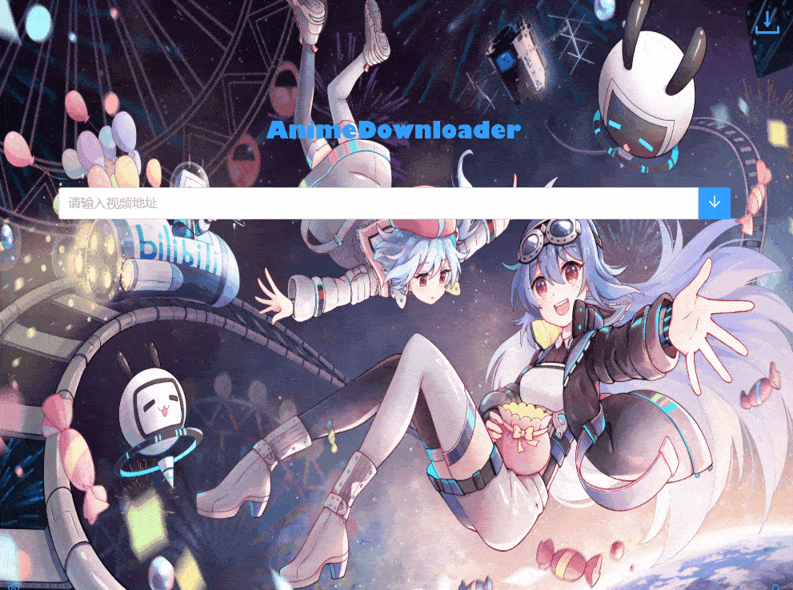

# AnimeDownloader


[](https://github.com/UHungLin)
[](https://github.com/UHungLin/AnimeDownloader/stargazers)
[](https://github.com/UHungLin/AnimeDownloader/fork)


## 番剧下载器

## :blush: ​使用教程

### 下载 B 站视频
支持的类型

- 普通视频（不支持互动类视频）

- 番剧

- 电影

- 纪录片

- ...

  


### 下载A站视频

支持类型

- 普通视频
- 番剧（不支持付费视频）


### 下载樱花动漫视频

支持类型

- 部分支持（加密的 m3u8 类型视频不支持，有空加）

注意该网站较慢，不要一次性选择下载太多



## :smiley: ​开发

本项目后端使用 `java` + `netty`，前端使用 `electron`

其中前端项目是由 [`BilibiliVideoDownload`](https://github.com/blogwy/BilibiliVideoDownload) 这个项目修改的，我把里面下载逻辑删了，改成用 `websocket` 和后端通信，顺便改了下样式布局

（PS：本来自己想用 `JavaFx` 或者 `electron` 写的，可写出来的太丑了.... :stuck_out_tongue:）

## :satisfied: ​编译运行

```
git@github.com:UHungLin/AnimeDownloader.git
cd AnimeDownloader/lin-frontend
yarn
yarn electron:serve
yarn electron:build

cd ../lin-server
mvn clean package
java -jar lin-server.jar
```

**注意：`windows` 用户记得把 ffmpeg.exe 放在和 lin-server.jar 同一层的目录下，`linux` 或 `mac` 用户需要在电脑中安装 `ffmpeg`（[官网](http://www.ffmpeg.org/download.html)），否则无法合并 B 站下载的视频。**

## :grin: ​ `Windows` 用户看过来

如果不想安装编译环境，也可以直接[下载](https://github.com/UHungLin/AnimeDownloader/releases/download/v1.0.0/AnimeDownloader.zip)打包好的 `exe` 文件

```
1、下载，解压到 ./AnimeDownloader 文件夹下
文件结构
- AnimeDownloader
	- animeDownloader-server
	- AnimeDownloader Setup 1.0.0.exe
2、双击 AnimeDownloader Setup 1.0.0.exe 安装到当前文件夹 ./AnimeDownloader 下
3、打开 animeDownloader-server
双击 setup.exe 安装到 ./animeDownloader-server 下
4、安装完成文件结构
- AnimeDownloader
	- AnimeDownloader
	- animeDownloader-server
打开 AnimeDownloader，双击 AnimeDownloader.exe 即可启动软件
```

## :exclamation: ​注意事项

- 下载完成的视频最好不要用 `windows` 自带的播放器播放，可以用 `mpv`、迅雷影音等其他视频播放器

  因为在下载 B 站视频时，有时下载到的视频格式是 `HEVC/H.265`，`windows` 自带的播放器或浏览器缺少相关的编解码器

- 无法下载 B 站区域限制的视频
- 想下载 B 站大会员视频，需要先登录大会员账号

## :heartpulse: ​感谢

##### [proxyee-down](https://github.com/proxyee-down-org/proxyee-down)

##### [BilibiliDown](https://github.com/nICEnnnnnnnLee/BilibiliDown)

##### [BilibiliVideoDownload](https://github.com/blogwy/BilibiliVideoDownload)

##### [FileDownloader](https://github.com/lingochamp/FileDownloader)


